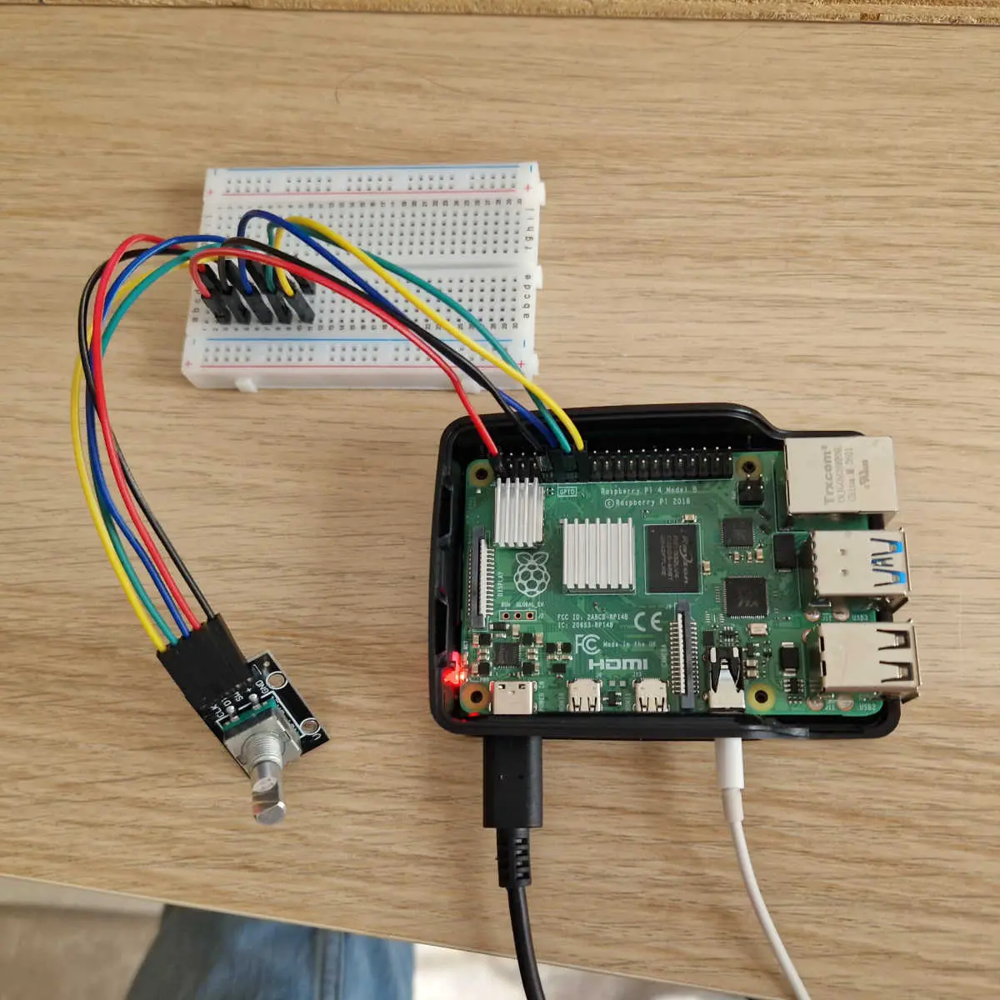

# 🔌 Hardware & Wiring (KY-040 Rotary Encoder)

### 1. Overview & Components

Storybox connects a single standard **KY-040 rotary encoder module** directly to the Raspberry Pi GPIO header. No soldering, breadboards, or extra resistors are required (the KY-040 already has its own pull-up resistors on its PCB).

---

### 2. Pinout & Wiring Map

The KY-040 has 5 pins. Always read the silkscreen on **your** module — the physical pin order varies by manufacturer.

| KY-040 Pin | Pi Physical Pin | Pi BCM Pin  | Signal / Function | Wiring Description                        |
|------------|-----------------|-------------|-------------------|-------------------------------------------|
| `+` (VCC)  | **Pin 1**       | —           | **3.3V Power**    | Module power supply (⚠ **Never use 5V**) |
| `GND`      | **Pin 9**       | —           | **Ground**        | System ground                             |
| `SW`       | **Pin 11**      | **GPIO 17** | **Push Button**   | Active-low button switch (knob press)     |
| `DT`       | **Pin 13**      | **GPIO 27** | **Data (DT)**     | Quadrature signal B                       |
| `CLK`      | **Pin 15**      | **GPIO 22** | **Clock (CLK)**   | Quadrature signal A                       |

> 💡 **Physical Header Layout**:
> - All used pins are in the **left column (odd-numbered pins: 1, 9, 11, 13, 15)** of the 40-pin GPIO header when the Raspberry Pi is positioned with the USB ports facing toward you.
> - Each Dupont wire goes directly from KY-040 → Pi (no in-between hops needed).


*CLK/DT/SW/+/GND wired from the KY-040 through a breadboard into the Pi's GPIO header.*

---

### 3. Safety Checklist Before Powering On

1. ⚠️ **Pi is unplugged** while wiring.
2. ⚠️ **Use 3.3V (Pin 1)**, **NEVER 5V (Pin 2)**. 5V into a Raspberry Pi GPIO line will permanently damage the SoC.
3. ⚠️ **Confirm pin numbering**: Count from Pin 1 (marked with a small square / beveled corner on the PCB silkscreen, near the MicroSD card slot).
4. **Direct connections**: Ensure each female-to-female Dupont wire connects securely from the KY-040 header to the Pi pins.
5. **Double-check colors**: Verify your wire color-to-pin mapping before connecting the power supply.

---

### 4. Pi 4 vs Pi 5 Compatibility

The wiring is **identical** between Raspberry Pi 4 and Raspberry Pi 5:
- Same 40-pin header layout.
- Same BCM pin numbering (`GPIO 17`, `GPIO 27`, `GPIO 22`).
- Same 3.3V logic level.

The only difference under the hood is the Linux GPIO character device (`gpiochip`):
- **Pi 4** → `/dev/gpiochip0`
- **Pi 5** → `/dev/gpiochip4`

**Pi4J v2** detects this automatically at runtime based on the detected board architecture — no manual configuration is required.

---

### 5. Verifying Wiring Without Code

Once powered on, you can verify that the GPIO pins and pull-ups are functioning at the OS level using `gpioinfo` (from `libgpiod-utils`):

```bash
# On the Raspberry Pi
gpioinfo | grep -E "17|22|27"
```

*Expected result*: Lines 17, 22, and 27 should appear as input with pull-ups enabled. When the knob is at rest, CLK and DT both read HIGH (1). Rotating the knob causes them to flicker / pulse low and high as the mechanical contacts make and break.

---

### 6. Troubleshooting

| Issue                                                    | Cause                                           | Solution                                                                                                                                                                                                                                                           |
|----------------------------------------------------------|-------------------------------------------------|--------------------------------------------------------------------------------------------------------------------------------------------------------------------------------------------------------------------------------------------------------------------|
| **Rotation direction is inverted** (CW behaves like CCW) | Quadrature signal wires swapped                 | Swap the `CLK` (Pin 15) and `DT` (Pin 13) Dupont wires on the Pi header. No code change needed.                                                                                                                                                                    |
| **No events when turning the knob**                      | Profile or GPIO setting disabled                | 1. Check that the application is running with the `pi` profile (`curl http://storybox:8080/actuator/env \| grep profile`).<br>2. Verify `storybox.gpio.enabled=true` in effective configuration.<br>3. Check application logs for `KY-040 initialized` at startup. |
| **Permission denied on `/dev/gpiochip*`**                | User not in `gpio` group                        | Add your user to the `gpio` group and reboot:<br>`sudo usermod -aG gpio $USER`<br>`sudo reboot`                                                                                                                                                                    |
| **Button press unresponsive**                            | Pin 11 (`SW` / `GPIO 17`) loose or misconnected | Verify Dupont connection to Pin 11 and ensure ground contact when knob is pressed.                                                                                                                                                                                 |
